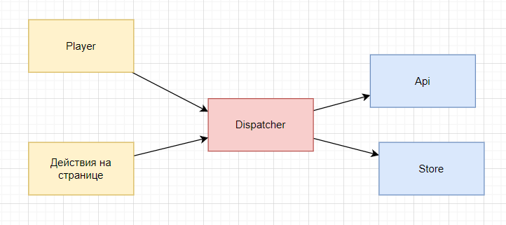

<h1>Doc on player</h1>
<h2>Загрузка трека</h2>
 

При неообходимости перейти по трекам вперёд назад будет вызываться событие <code>DOWNLOAD_DIRECTIONAL_TRACK</code>,
которое содержит направление, положительное +1 и отрицательное -1, и будет обработано в <code>Store</code>, 
где будет возращен ответ.
  
Ответ возращается по двум событиям:
<li> <code>DOWNLOAD_NEW_TAPE {JSON}</code> - Нужно загрузить новую ленту треков, так как на <code>Store</code> кончился список.</li> 
<li> <code>DOWNLOADING_ID {JSON}</code> - скачать трек с id; </li> 
  
После загрузки трека вставляется в соурс, а также меняется название, артист, cover.
  
Загрузка осуществляется через <code>API</code>. Вызывается:

<li> <code>get api/tracks/{id}/record</code> - для бинарного файла</li>
<li> остальная информация приходит из <code>Store</code>; </li>

<h2>Repeat</h2>
При нажатии на кнопку повторения, будет ставиться флаг в самом плеере на то, что музыка повторяется.

<h2>Volume</h2>
При изменении громкости будет создаваться <code>CHANGE_VOLUME</code> с значением громкости, после чего возращается со 
<code>Store</code>, где уже меняется значение.

<h2>Artist/Album/Track добавление в конец</h2>
Отправляются <code>Action: playTrack(id), playAlbum(id), playArtist(id)</code>, которые передают значение <code>id</code>
для скачивания песен в конец. 
После получения данных действия будет прокидываться метод через <code>View</code> для скачивания нужных треков и добавление
их в конец. 

<h2>Artist/Album/Track запуск вместо</h2>
Отправляются <code>Action: queueTrack(id), queueAlbum(id), queueArtist(id)</code>, которые передают значение <code>id</code>
для скачивания песен в конец. 
После получения данных действия будет прокидываться метод через <code>View</code> для скачивания нужных треков и добавление
вместо присутствующих. 

<h2>Change Type</h2>
Также имеется возможность смены типа <code>Store</code>.
На <code>Artist/Album/Track</code> будет срабатывать также и смена хранимых данных.

