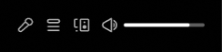

При нажатии на кнопку "вперёд/назад", будет вызваны события <code>DOWNLOAD_DIRECTIONAL_TRACK</code>, с тем, в какое направление нужно идти.
Он идёт в <code>Store</code>, после чего отправляется название трэка обратно. Отправляется <code>DOWNLOAD_TRACK</code> с внутренним
параметром имени трека. Это действие отправляется на <code>API</code>, откуда в <code>SongStore</code>, а оттуда уже в плеер.

Также при нажатии на кнопку повторение будет вызвано событие
<code>REPEAT_SONG</code>, что поставит в <code>Store</code> флаг на повторение. 
При этом <code>Store</code> будет возращать Название трека и статус, де статус говорит, что качать трек не нужно.

<code>Store</code> будет храниться список песен, которые могут быть вызваны(<code>id</code> of track)

Событие изменения звука вызывают <code>SONG_VOLUME</code> и значение, которое оно принимает в <code>STORE</code>.

Когда меняется звук происходит <code>VOLUME_CHANGE</code> с цифрой, на какую изменился. После получает от SongStore ответ, и меняет своё состояние тоже. 

